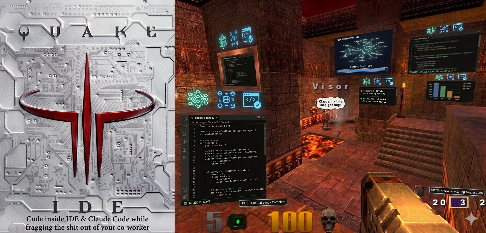

# q3ide



Q3IDE ("Quake III IDE") turns a Quake III Arena (quake3e fork) into a multi-monitor, live developer workspace with all your existing tools, LLMs. Live macOS windows stream as real-time textures onto in-game surfaces using ScreenCaptureKit, rendered through a modified Quake3e engine. The project follows Apple VisionOS design language (Windows, Ornaments, Hover effects).

It has its own **window management library** it has "adaptive resolution capture pipeline." 

## Vibe Coding? Pfff! Frag Coding! 

Imagine that you are...
- inside Quake III Arena on 3 monitors or VR. 
- All your macOS/terminal/IDE windows are tunneled into the game as windows.
- You don't navigate by files anymore. LLMs do that. You navigate by UML class diagrams, component diagrams visually displayed in the game scene.
- Each room, each wall has files which makes everything have a special meaning in your projects and codebase. It's all loci! It's all 3D and fun.
- Multiple AI agents and clawbots are running, coding, and shooting inside the game. 
- You are not waiting because you're fragging the shit out of your co-worker. 
- You setup an office desk in the corner with your radio station because Claude Code is ready. 
- You Run, Test, Build then launch a rocket under the desk of your boss. 
- Then you tell the OpenClaw game bot to order pizza before rail gunning him too.

Zuk got it wrong with Meta world. We need some blood here for the love of god.

Yeah. That's my vision. Can you imagine? I'm a believer. 

- This is not only a virtual desktop, IDE
- This is not only an LLM orchestrator with multi-project support
- This is not only a new way (UML class/component diagrams) to interact with your code
- This is not only a boring VR gimmick with stars wallpaper as background
- This is not only a multiplayer co-working environment

It's the beginning of something more with an awesome FPS engine behind it. 

--

## Quick Start

Add Quake 3 pack files into `/baseq3/` then:

```bash
sh ./scripts/build.sh --release stable --run
```

or with extras:
```bash
sh ./scripts/build.sh --release stable --run --level q3dm0 --bots 0 --music 0 --execute '' --clean
```

--

## Features working

- **Quake with 3 monitors**:: 1920 x 1080 @ **90FPS** *we keep this value maximized*
- **Multi-window tunneling from macOS to Quake** (SCStream → texture → GPU)
  - **Stream Router**: Display Composition Stream vs Per-window SCStream - both have their advantages and disadvantages. Extra 20% FPS gains.
    - COMPOSITE for CPU apps (Terminal, etc) - 1 screen where each terminal window gets cropped - more efficient
    - DEDICATED for GPU apps (Browser, VLC, etc)
  - **Both-sides window rendering**: windows are visible from front AND back efficiently 
  - **Pause SCStream**: 
    - to get back the 90 FPS in game (`STREAMS_PAUSED` AtomicBool — `get_frame()` returns None, last frame frozen on GPU, streams stay warm). This can be leveraged in a BIG BIG matter.
    - **Auto-pause streams while moving** — streams freeze when you run (same FPS boost as holding `;`), resume when you stop.
      - Window you're **looking at stays live** — the aimed/highlighted window is never paused, even while moving.
      - **Movement** = position change in X/Y/Z (running, strafing, getting knocked back by explosions or other players).
      - **Not moving** = standing still, turning, looking around — these do NOT trigger a pause.
      - Uses client-predicted position (not server snapshots) so detection is accurate every frame.
  - **Gracefull FPS control**: new windows spawns with [1,2,4,8,16,32,auto]
  - **Idle SCStream**: `IN-PROGRESS` apple idle detector is not that great for use. We sample every 1s for changes and pause streams :) FPS saver feature!
- **Window Manager**
  - **Focus and Overview**: with different window layouts
    - "I" shows your monitors
    - "O" shows an overview off all windows on macOS 
  - **Highlight window**: on aim
  - **Move window**: Highlight window + hold "CMD" then aim to move existing windows on wall 
  - **Zoom window**: Highlight window + hold "CMD" + SCROLL to make existing window on wall bigger/smaller
  - **Shot wall**: to place window 1,2...N
  - **Reposition existing window**: shot window THEN now place on the wall (works in "O" Overview too)
- **MacOS daemon**
  - Auto attach/detach new and closed macOS windows into Quake (PollChanges)
  - Unminimizes every app and re-focuses Quake before first attach
  - ICC color restore on cmd-tab — monitors snap back to calibrated profiles the moment you leave Quake. Otherwise we have white windows when using SCStream
- **Spatial Context / Window Placement**
  - LOS visibility culling (per-frame trace)
  - AAS area detection (just tracking, no placement)
- **Other Hotkeys/Feaures**: with 'Hold & Release' for temporary enable
  - "H" to hide ALL windows
  - "K" to kill ALL windows
  - "M" to show menu for custom maps/skins
  - ";" to freeze stream (last frame frozen, 100% FPS regain)
  - `IN-PROGRESS` "L" to highlight ALL windows with a laser ray pointing to it
- **Left Monitor Overlay**: rate-limited
  - keybindings
  - notifications
  - list of windows
  - stats
- **Console commands**: q3ide list / status / detach
- **Extras**: 
  - Quake CiNEmatic mod for 4K/8K/16K AI-redrawn, specifically recommends quake3e
  - Vulkan `graphics CFG settings` are MAXED OUT for my (not bad) RX580 8GB card

---

## Quake3e Changes

**Currently we have `QUAKE3E CODE CHANGE RATIO = 1.85%`**
*we keep this number minimized while developing*

531 lines across 14 files out of 28,769 total original lines.

The heaviest hit is sdl_glimp.c (12% — multi-monitor spanning window) and Makefile (16% — build rules and q3ide sources).
Everything else is under 3%.

Build
- Makefile — USE_Q3IDE=1, USE_OPENGL2=0, USE_VULKAN=1, USE_RENDERER_DLOPEN=1, -DSTANDALONE (no CD key), 54 q3ide object files + build rules

Renderer Common
- tr_types.h — MAX_VIDEO_HANDLES 16 → 100 (one handle per tunneled window)
- tr_public.h — UploadCinematic() added format param (GL_BGRA/GL_RGBA)

Renderer GL1
- tr_local.h — updated UploadCinematic signature
- tr_arb.c — whitespace only (1 line)

Renderer Vulkan
- tr_backend.c — RE_UploadCinematic() handles BGRA format param for window streams
- tr_local.h — updated UploadCinematic signature
- tr_scene.c — RE_RenderScene() preserves entities/dlights across side-monitor passes
- tr_init.c — r_fbo default 0 → 1 (required for Vulkan multi-viewport)
- vk.c — center-monitor 2D viewport offset + ortho MVP for multi-monitor HUD

Client Core
- cl_main.c — Q3IDE_Init/Shutdown/Frame/OnVidRestart hooks; vidWidth/H override to center monitor size
- cl_cgame.c — Q3IDE_MultiMonitorRender() replaces re.RenderScene(); vidWidth override for HUD scale
- cl_keys.c — Q3IDE_OnKeyEvent() called first; key passthrough to game

SDL / Platform
- sdl_glimp.c — borderless window spanning all monitors; r_multiMonitor cvar; Q3IDE_HideMenuBarAndDock() via ObjC


--

## Q3IDE Roadmap

While keeping FPS at 90..

| Phase | Milestone | Batch | Status |
|-------|-----------|-------|--------|
| 1 | **Vision, architecture, design language** | 0 | ✅ Done |
| 2 | **MVP — terminal on nearest wall at spawn** | 0 | ✅ Done |
| 3 | **Multiple windows, floating panels** | 0 | ✅ Done |
| 4 | **Multi-window tunneling (unique windowID per SCStream)** | 0 | ✅ Done |
| 5 | **Three-monitor support** | 0 | ✅ Done |
| 6 | **Window Entity data model** & lifecycle management | 2 | 🔧 In Progress |
| 6.1 | ↳ **Kill BGRA→RGBA swizzle (GL_BGRA native)** | 2 | ✅ Done |
| 6.2 | ↳ **Hybrid CaptureRouter (COMPOSITE + DEDICATED, +20% FPS)** | 0 | ✅ Done |
| 6.3 | ↳ **Idle/Pause SCStreams with better idle detector** | 0 | 🔧 In Progress |
| 6.4 | ↳ Visibility-gated texture uploads (dot product + BSP trace) | 2 | — |
| 6.5 | ↳ Texture Array (GL_TEXTURE_2D_ARRAY, batched draw calls) | 2 | — |
| 6.6 | ↳ Apple FPS vs FPS Cap | 0 | — |
| 6.7 | ↳ Wall scanner + cache (pre-scan on area entry) | 2 | — |
| 6.8 | ↳ Area transition placement (destroy old rules, build new) | 2 | — |
| 6.9 | ↳ Within-area leapfrog (furthest window jumps forward) | 2 | — |
| 6.10 | ↳ Trained positions (dogs remember their spot) | 2 | — |
| 6.11 | ↳ Adaptive resolution (8 tiers, SCK source-side downscale) | 2 | — |
| 6.12 | ↳ Static detection + SCK frame interval + mipmaps | 2 | — |
| 6.13 | ↳ Per-window performance metrics | 2 | — |
| **7** | **🏗️ ARCHITECTURE OVERHAUL** — Q3IDE_ARCHITECTURE.md | 7 | — |
| 7.1 | ↳ Layer skeleton + adapter — directory structure, engine/adapter.h, Quake3e implementation | 7 | — |
| 7.2 | ↳ Object model — SpatialObject_t, Window_t enums, scene graph, stable IDs, lifecycle contract, all stubs | 7 | — |
| 7.3 | ↳ Render + Space contract — single dispatch loop, SpaceWindowView, Wall cache, UI theme + primitives, rendering standards | 7 | — |
| 7.4 | ↳ Quality gates — error state on every object, -Wswitch, lint.sh, q3ide_params.h discipline, /q3ide_debug | 7 | — |
| 7.5 | ↳ File migration — all 47 files moved, renamed, and verified in new structure | 7 | — |
| 8 | Interaction model — Pointer Mode, Keyboard Passthrough, dwell detection | 3 | — |
| 9 | Live window management — auto-attach/detach, title tracking, status HUD | 4 | — |
| 10 | Window placement & layout — drag, resize, lock, snap, persist | 5 | — |
| 11 | Grapple Hook, Laser, minimap, File Browser, Quick Open | 6 | — |
| 12 | Theater Mode, Office Mode, Control Center | 8 | — |
| 13 | Spaces (ASK→GARAGE) & Portal navigation | 9 | — |
| 14 | Programmable hotkeys, virtual keyboard, screenshots, video recording | 10 | — |
| 15 | Ornaments, Vibrancy, context menus | 11 | — |
| 16 | Project file classification & live filesystem scanning | 12 | — |
| 17 | UML Navigator — 3D architecture diagrams, node clouds, animated pipes | 13 | — |
| 18 | AI agent orchestrator — spawn, diff viewer, approve/reject, dashboard | 14 | — |
| 19 | Spatial audio, per-Window audio, ducking, notifications | 15 | — |
| 20 | Multiplayer — window sharing, proximity resolution, pair programming | 16 | — |
| 21 | quakeOS — native rendering, syntax highlighting, nano editor, focus mode | 17 | — |
| 22 | Game modes — synchronized rounds (CODE→FRAG→TEST→RUN) | 18 | — |
| 23 | Map skins, Office Mode styles, Volume baseplate | 19 | — |
| 24 | Advanced audio — spatialized voice chat, session recording & playback | 20 | — |
| 25 | Custom Q3 map designed for 8 Spaces | 21 | — |
| 26 | OpenClaw bot — fragging AI colleague with chat Window | 22 | — |
| 27 | AI runtime geometry — props + structural mesh on top of BSP | 23 | — |
| 28 | Browser-ready WASM port via Emscripten | 24 | — |
| 29 | Swap engine adapter to VR Quake 3 fork | VR | — |

See [`plan/00-VISION.md`](./plan/00-VISION.md) for Vision.
See [`plan/04-Q3IDE_SPECIFICATION.md`](plan/04-Q3IDE_SPECIFICATION.md) for full Specification

---


## Building

Add Quake 3 pack files into `/baseq3/` then:

```bash
sh ./scripts/build.sh --run --release stable --level q3dm0 --bots 0 --music 0 --execute '' --clean
```

---

## `build.sh` Options

```
sh ./scripts/build.sh [options]
```

| Flag | Description |
|------|-------------|
| `--run` | Launch the game after a successful build |
| `--clean` | Run `make clean` before building (full rebuild) |
| `--engine-only` | Skip Rust dylib build — only recompile the engine (faster iteration). **Never combine with `--clean`** — clean deletes the dylib and engine-only won't copy it back. |
| `--api` | Start the Remote API server (`scripts/remote_api.py`) in the background before launching |
| `--level <map>` | Map to load. Shorthand: `0`→`q3dm0`, `7`→`q3dm7`, or full name like `q3dm17` or `r` for random custom map made by other cool people ;) Default: whatever is in `autoexec.cfg` |
| `--execute '<cmd>'` | Console command(s) to run after the map loads (~60 frames after spawn). Supports semicolons: `'q3ide attach all; set cg_drawFPS 1'` |
| `--bots <n>` | Add N bots to the game (sets `bot_minplayers` to N+1) |
| `--music` | Enable random background music track on q3dm0 |

### Examples

```bash
# Full build + run on q3dm0
sh ./scripts/build.sh --run --level 0

# Engine-only rebuild (skip Rust, fast) + run
sh ./scripts/build.sh --engine-only --run

# Clean full rebuild
sh ./scripts/build.sh --clean --run --level 7

# Build + start API + run with bots
sh ./scripts/build.sh --run --api --level 0 --bots 3
```

---

## Remote API (`scripts/remote_api.py`)

Run on macOS: `python3 scripts/remote_api.py` (or use `--api` flag above).

Agents / Claude Code call it from Docker at `http://host.docker.internal:6666`.

### Endpoints

| Method | Path | Body / Params | Description |
|--------|------|---------------|-------------|
| `POST` | `/build` | `{"args": [...]}` | Queue a build. Same flags as `build.sh` (e.g. `["--engine-only"]`) |
| `GET` | `/build/status` | — | Current build status + queue depth |
| `GET` | `/queue` | — | Full build queue (pending + history) |
| `DELETE`| `/queue` | — | Cancel pending builds + kill running build |
| `POST` | `/run` | `{"args": [...]}` | Launch the game. Optional `build.sh` args. Kills any running instance first (lock-protected — never spawns two). |
| `POST` | `/stop` | — | Kill the running game process |
| `POST` | `/kill` | — | Alias for `/stop` |
| `GET` | `/status` | — | Game running state, PID, uptime |
| `POST` | `/console` | `{"cmd": "..."}` | Send RCON command, returns response |
| `GET` | `/logs` | `?file=engine&n=100` | Tail log file. `file`: `engine`, `q3ide`, `capture`, `build`, `multimon` |
| `GET` | `/events` | — | Last 100 structured events (JSON lines) |
| `POST` | `/lint` | — | Run `scripts/lint.sh`, returns output |
| `GET` | `/lint` | — | Same |
| `WebSocket` | `/ws` | `?logs=engine,q3ide` | Stream log lines + status heartbeat (5s). Send `{"cmd":"..."}` for RCON. Receives `game_stopped` event when game exits. |

### Examples

```bash
# Build engine only
curl -X POST http://localhost:6666/build -H "Content-Type: application/json" \
  -d '{"args":["--engine-only"]}'

# Launch game on q3dm7 with 2 bots
curl -X POST http://localhost:6666/run -H "Content-Type: application/json" \
  -d '{"args":["--level","7","--bots","2"]}'

# Run RCON command
curl -X POST http://localhost:6666/console -H "Content-Type: application/json" \
  -d '{"cmd":"q3ide status"}'

# Tail last 50 lines of game log
curl "http://localhost:6666/logs?file=engine&n=50"

# Kill the game
curl -X POST http://localhost:6666/stop
```

---

## In-Game Console Commands

Open with `~`. Single `q3ide` dispatcher:

| Command | Description |
|---------|-------------|
| `q3ide list` | List all capturable macOS windows |
| `q3ide detach` | Detach all windows |
| `q3ide status` | Show active windows, capture status, dylib info |

---

## Manual Build

```bash
cd capture && cargo build --release    # Rust capture dylib
cd quake3e && make ARCH=x86_64         # or arm64
```

## Platform Requirements

- macOS 12.3+ (ScreenCaptureKit dependency)
- Quake 3 Arena game data (`pak0.pk3` in `baseq3/`)
- Rust toolchain, Xcode Command Line Tools
- Screen Recording permission for engine binary

---


## How It Works

Each room in the map can represent a section of the codebase. Walk into the `auth/` room and the authentication code is on the walls. The database room has the schema. You build *spatial memory* of your architecture — the [Method of Loci](https://en.wikipedia.org/wiki/Method_of_loci) applied to software, where every module has a place and every place has meaning.


```
macOS Desktop                              Quake III Arena
┌──────────────┐                          ┌────────────────────────┐
│  iTerm2      │──COMPOSITE (shared)─────►│                        │
│  Terminal    │   1 stream/display        │  Wall texture (live)   │
│              │   crop per window         │                        │
├──────────────┤                          │  You, with a railgun   │
│  Safari      │──DEDICATED (per-window)─►│                        │
│  Xcode       │   with_window() filter   │                        │
│  Cursor      │   correct GPU layers     └────────────────────────┘
└──────────────┘

         CaptureRouter (capture/src/router.rs)
         selects mode per app at attach time
```

A Rust dylib (`capture/`) captures desktop windows via Apple's `ScreenCaptureKit` framework using a **Hybrid CaptureRouter**: CPU-rendered apps (terminals) share one display-level stream per monitor — no stream limit, no camera icon per app. GPU-accelerated apps (browsers, IDEs, Electron) get isolated per-window streams for correct Metal layer compositing. Pixel data streams into a lock-free ring buffer; the engine polls each frame and uploads as a dynamic texture.

The engine layer is abstracted — Quake3e today, potentially a VR engine tomorrow.

---

## Current Status

**Pre-alpha. Architecture and design phase.**

The vision doc, architecture doc, design language reference, and project prompt are written. Code hasn't started yet.

### MVP Goal

When you spawn, all your terminal windows appears on the nearest wall and in front of you. Live. Updating at game framerate. View only.

That's it. Everything else comes after.

---

## Design Language

All spatial UI follows [Apple VisionOS](https://developer.apple.com/visionos/) terminology and design patterns:

| VisionOS | q3ide |
|----------|-------|
| Window | Live desktop panel — captured macOS window as in-world texture |
| Ornament | Floating control strip attached to a Window edge |
| Hover Effect | Crosshair-aim glow and z-lift on interactive elements |
| Shared Space | Multiplayer — everyone's Windows coexist |
| Full Space | The Quake 3 map itself |

This is intentional. When the engine moves to VR, the design language will already be native.

---

## Architecture

```
q3ide/
├── capture/                # Rust dylib — ScreenCaptureKit wrapper
│   ├── src/
│   │   ├── lib.rs          # C-ABI exports
│   │   ├── backend.rs      # CaptureBackend trait
│   │   ├── router.rs       # CaptureRouter — COMPOSITE vs DEDICATED selection + whitelists
│   │   ├── screencapturekit.rs  # Hybrid backend (both modes)
│   │   ├── ringbuf.rs      # Lock-free frame buffer
│   │   └── window.rs       # Window enumeration
│   └── Cargo.toml
│
├── scripts/
│   └── build.sh            # Builds & runs Q3ide
|
├── engine/
│   ├── adapter.h           # Abstract engine interface
│   └── quake3e/            # Quake3e adapter implementation
│
├── spatial/                # Engine-agnostic game logic
│
├── plan/
│   ├── 00-VISION.md                          # Full project vision
│   ├── 01-VISIONOS_DESIGN_LANGUAGE.md       # VisionOS design reference
│   ├── 02-Q3IDE_INITIAL_PROMPT.md           # Initial project prompt / architecture
│   ├── 03-Q3IDE_ORCHESTRATION.md           # Agent orchestration setup
│   ├── 04-Q3IDE_SPECIFICATION.md           # Full feature spec + tracker
│   ├── 05-Q3IDE_PERFORMANCE_OPTIMIZATION.md # Perf brainstorm
│   ├── 06-Q3IDE_OPTIMIZATION_TRICKS.md     # Optimization tricks
│   ├── 07-Q3_HD_UPGRADE_PROCEDURE.md       # HD texture upgrade guide
│   ├── 08-WINDOW_RULES.md                  # Window lifecycle rules
│   ├── 09-WINDOW_PLACEMENT_SYSTEM.md       # Placement system design
│   ├── 10-Q3IDE_ARCHITECTURE.md            # Architecture overhaul plan
│   ├── 11-Q3IDE_UML_MERMAID.md             # UML diagrams
│   └── 12-QUAKE_CONSTRUCTOR.md             # Quake constructor reference
│
└── README.md
```

**Key principle:** The engine is swappable. All engine-specific code lives behind an adapter trait. Capture and spatial logic never call engine internals directly. A VR fork of Quake 3 is being developed separately and may become the target engine.

---

## Tech Stack

| Layer | Technology |
|-------|-----------|
| Engine | [Quake3e](https://github.com/ec-/Quake3e) (OpenGL + Vulkan, macOS) |
| Capture | [ScreenCaptureKit](https://developer.apple.com/documentation/screencapturekit) via [screencapturekit-rs](https://github.com/svtlabs/screencapturekit-rs) |
| Bridge | Rust dylib with C-ABI, loaded at runtime |
| Frame transport | Lock-free ring buffer (`crossbeam`) |
| Texture upload | `glTexSubImage2D` (GL) / staging buffer (Vulkan) |
| Platform | macOS 12.3+ (Apple Silicon + Intel) |

---


## Prior Art

Nothing quite like this exists. Related projects occupy adjacent spaces:

- **[SimulaVR](https://github.com/SimulaVR/Simula)** — Linux VR desktop compositor on Godot. No game, no fun.
- **[Immersed](https://immersed.com/)** — VR multi-monitor workspace. Closed source, no game.
- **[xrdesktop](https://gitlab.freedesktop.org/xrdesktop/xrdesktop)** — Linux desktop windows as OpenVR overlays. Research-grade.
- **[RiftSketch](https://github.com/brianpeiris/RiftSketch)** — VR live coding toy for Three.js. Single user proof of concept.
- **[CodeCity](https://wettel.github.io/codecity.html)** — 3D city visualization of codebases. Static, not a game.

q3ide is the first to combine: live desktop streaming + multiplayer FPS + spatial code architecture + AI agent workflow.

---

## The Idea

IDEs flatten everything into a file tree. Tabs. More tabs. A spreadsheet pretending to be a creative tool.

The human brain is wired for spatial memory, not text memory. The [Method of Loci](https://en.wikipedia.org/wiki/Method_of_loci) — the 2000-year-old memory palace technique — works because we remember *places* better than *lists*. Research shows VR environments using this technique produce ~20% better recall, and that's with passive walking. Add adrenaline, competition, and social presence? The encoding goes deeper.

Six months from now, someone asks "where's the rate limiter?" Your brain doesn't think `src/middleware/ratelimit.ts`. It thinks *"second floor, the room with the railgun pickup, near the screen that shows the Redis dashboard."*

"Meet me in the database room" becomes a real sentence with a real location.

---

## License

[BSL 1.1](LICENSE) — source-available, no production use without permission. Converts to MIT after 4 years.

---

*Depth, not flat. Spatial, not tabbed.*
