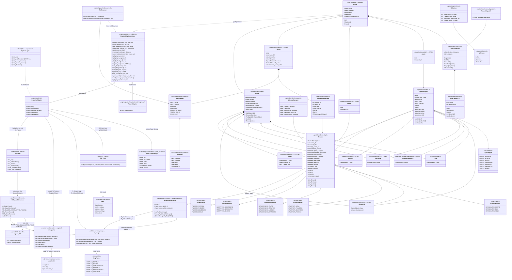

```mermaid
classDiagram

    %% ─────────────────────────────────────────
    %% QUAKE3E ENGINE INTERNALS
    %% Read-only reference — spatial/ never touches these
    %% ─────────────────────────────────────────

    class CL_Main {
        <<code/client/cl_main.c>>
        +CL_Init()
        +CL_InitRenderer()
        +CL_Frame()
        +CL_ShutdownAll()
        +SCR_UpdateScreen()
        +Cmd_AddCommand()
    }

    class refexport_t {
        <<renderer function table — re global>>
        +re_RegisterShader(name) qhandle_t
        +re_AddPolyToScene(shader, n, verts)
        +re_RenderScene(refdef)
        +re_BeginFrame()
        +re_EndFrame()
        +re_BeginRegistration(glconfig)
    }

    class tr_image {
        <<code/renderer/tr_image.c>>
        +R_CreateImage(name, name2, pic, w, h, flags) image_t
        +R_UploadSubImage(data, x, y, w, h, image)
        +Upload32(data, x, y, w, h, image, subImage)
    }

    class imgFlags_t {
        <<enumeration>>
        +IMGFLAG_MIPMAP
        +IMGFLAG_PICMIP
        +IMGFLAG_CLAMPTOEDGE
        +IMGFLAG_NOSCALE
        +IMGFLAG_NOLIGHTSCALE
        +IMGFLAG_LIGHTMAP
    }

    class CM_Trace {
        <<code/cm_trace.c>>
        +CM_BoxTrace(results, start, end, mins, maxs, model, brushmask)
    }

    class trace_t {
        <<Q3 trace result struct>>
        +float fraction
        +vec3_t endpos
        +cplane_t plane
        +int surfaceFlags
        +int contents
    }

    class BSP_SurfaceFlags {
        <<surfaceflags.h mirrored in q3ide_params.h>>
        +SURF_SKY
        +SURF_NODRAW
        +SURF_HINT
        +SURF_SKIP
        +CONTENTS_SOLID
        +MASK_SOLID
    }

    class polyVert_t {
        <<Q3 renderer polygon vertex>>
        +vec3_t xyz
        +float st_2
        +byte modulate_4
    }

    class SCR_UpdateScreen {
        <<per-frame render chain>>
        +re_BeginFrame()
        +CL_DrawActiveGame()
        +VM_Call_CG_DRAW_ACTIVE_FRAME()
        +RE_RenderScene()
        +SCR_DrawConsole()
        +re_EndFrame()
    }

    class cgame_VM {
        <<cgame QVM slash DLL>>
        +CG_DrawActiveFrame()
        +trap_R_RenderScene()
    }

    %% ─────────────────────────────────────────
    %% CAPTURE LAYER
    %% ─────────────────────────────────────────

    class CaptureLayer {
        <<Rust dylib — capture/src/>>
        +q3ide_init()
        +q3ide_get_frame() Q3IDEFrame
        +q3ide_pause_streams()
        +q3ide_resume_streams()
        +q3ide_shutdown()
    }

    %% ─────────────────────────────────────────
    %% ENGINE ADAPTER LAYER
    %% ─────────────────────────────────────────

    class EngineAdapterInterface {
        <<engine/adapter.h — abstract>>
        +upload_texture(slot, w, h, data, fmt)
        +create_texture(w, h, fmt) int
        +add_quad(corners, uvs, slot, alpha)
        +draw_quad_2d(x, y, w, h, slot, alpha)
        +render_scene(refdef)
        +trace(start, end, out) qboolean
        +box_trace(start, end, mins, maxs, out)
        +get_player_pos(out)
        +get_player_angles(out)
        +get_player_area() int
        +register_cmd(name, fn)
        +register_cvar(name, def, flags)
        +cvar_float(name) float
        +read_file(path, buf) int
        +write_file(path, buf, len)
        +get_time_ms() uint64
        +play_sound(path, pos, vol)
        +spawn_entity(model, pos, angles) int
        +send_message(player_id, data, len)
        +get_players(out, max) int
    }

    class Quake3eAdapter {
        <<engine/quake3e/>>
        +Q3IDE_Init()
        +Q3IDE_InitTextures()
        +Q3IDE_UpdateCaptures()
        +Q3IDE_Shutdown()
        +Q3IDE_SetAdapter()
    }

    class FutureAdapter {
        <<engine/quake4/ engine/unreal/ engine/ar/>>
        +Q3IDE_SetAdapter()
    }

    %% ─────────────────────────────────────────
    %% SCRATCH SLOT SYSTEM
    %% ─────────────────────────────────────────

    class ScratchSlotSystem {
        <<texture naming chain — window/render.h>>
        +int slot_N
        +image_name_q3ide_N
        +shader_name_q3ide_windowN
        +Init_R_CreateImage()
        +Frame_R_UploadSubImage()
        +glTexSubImage2D_GL_BGRA()
    }

    %% ─────────────────────────────────────────
    %% Q3IDE BRAIN ROOT
    %% ─────────────────────────────────────────

    class Q3IDE {
        <<root singleton — spatial/>>
        +Scene scene
        +Space spaces_8
        +Agent agents
        +Audio audio
        +FeatureRegistry features
        +Init()
        +Shutdown()
        +Frame()
    }

    %% ─────────────────────────────────────────
    %% SCENE GRAPH
    %% ─────────────────────────────────────────

    class Scene {
        <<spatial/core/scene.h>>
        +Window windows
        +Portal portals
        +Widget widgets
        +Ornament ornaments
        +UMLNode uml_nodes
        +RuntimeGeometry geometry
        +Laser lasers
        +AddObject(obj)
        +RemoveObject(id)
        +FindById(id) SpatialObject
        +Update()
        +Render(refdef)
    }

    class SpatialObject {
        <<spatial/core/scene.h>>
        +int id
        +SpatialType_t type
        +int space_id
        +vec3_t pos
        +vec3_t normal
        +float w
        +float h
        +int render_layer
        +qboolean visible
        +qboolean active
        +char error_128
        +update(self)
        +render(self, refdef)
        +destroy(self)
    }

    class SpatialType {
        <<enumeration>>
        +STYPE_WINDOW
        +STYPE_PORTAL
        +STYPE_WIDGET
        +STYPE_ORNAMENT
        +STYPE_UMLNODE
        +STYPE_GEOMETRY
        +STYPE_LASER
    }

    %% ─────────────────────────────────────────
    %% WINDOW
    %% ─────────────────────────────────────────

    class Window {
        <<spatial/window/entity.h>>
        +SpatialObject_t base
        +uint native_id
        +char label_128
        +char app_name_64
        +WindowMode_t mode
        +WindowCapture_t capture
        +WindowPlacement_t placement
        +WindowLayout_t layout
        +WindowVisibility_t visibility
        +qboolean streaming
        +qboolean idle_apple
        +qboolean idle_ours
        +qboolean paused
        +int scratch_slot
        +qhandle_t shader
        +int tex_w
        +int tex_h
        +int res_tier
        +int ornament_ids_8
        +Win_Create()
        +Win_Destroy()
        +Win_Update()
        +Win_Render()
    }

    class WindowMode {
        <<enumeration>>
        +WMODE_NORMAL
        +WMODE_THEATER
        +WMODE_BILLBOARD
        +WMODE_FOCUS
    }

    class WindowCapture {
        <<enumeration>>
        +WCAPTURE_COMPOSITE
        +WCAPTURE_DEDICATED
        +WCAPTURE_ENGINE
    }

    class WindowPlacement {
        <<enumeration>>
        +WPLACEMENT_AUTO
        +WPLACEMENT_TRAINED
        +WPLACEMENT_LOCKED
        +WPLACEMENT_DRAGGING
    }

    class WindowLayout {
        <<enumeration>>
        +WLAYOUT_WALL
        +WLAYOUT_FLOATING
        +WLAYOUT_OVERVIEW
        +WLAYOUT_FOCUS3
    }

    class WindowVisibility {
        <<enumeration>>
        +WVISIBILITY_PRIVATE
        +WVISIBILITY_TEAM
        +WVISIBILITY_PUBLIC
    }

    class WindowManager {
        <<spatial/window/manager.h>>
        +Win_Create() Window
        +Win_Destroy(id)
        +Win_FindById(id) Window
        +Win_GetAll(out, max) int
        +Win_FindFurthest() Window
    }

    %% ─────────────────────────────────────────
    %% SPACE AND WALL SYSTEM
    %% ─────────────────────────────────────────

    class Space {
        <<spatial/space/space.h — STUB>>
        +int id
        +char name_32
        +qboolean active
        +int window_ids
        +SpaceWindowView views
        +CachedWall wall_cache
        +qboolean wall_cache_valid
    }

    class SpaceWindowView {
        <<spatial/space/space.h>>
        +int window_id
        +int space_id
        +vec3_t pos
        +vec3_t normal
        +float w
        +float h
        +WindowLayout_t layout
    }

    class WallScanner {
        <<spatial/space/wall_scanner.h>>
        +Scan(origin, dir, out) CachedWall
        +Wall_IsValidSurface(surfaceFlags, contents) bool
    }

    class CachedWall {
        <<spatial/space/wall_cache.h>>
        +vec3_t center
        +vec3_t normal
        +float width
        +float height
        +float dist_to_player
        +WallSlot slots_8
        +int slot_count
    }

    class WallSlot {
        <<spatial/space/wall_cache.h>>
        +vec3_t position
        +vec3_t normal
        +float width
        +float height
        +int window_id
    }

    %% ─────────────────────────────────────────
    %% SCENE OBJECT STUBS
    %% ─────────────────────────────────────────

    class Portal {
        <<spatial/space/portal.h — STUB>>
        +SpatialObject_t base
        +int dest_space_id
        +vec3_t spawn_pos
    }

    class Widget {
        <<spatial/ui/widget.h — STUB>>
        +SpatialObject_t base
    }

    class Ornament {
        <<spatial/ui/ornament.h — STUB>>
        +SpatialObject_t base
        +int parent_window_id
    }

    class UMLNode {
        <<spatial/uml/node.h — STUB>>
        +SpatialObject_t base
    }

    class RuntimeGeometry {
        <<spatial/ai_geometry/generator.h — STUB>>
        +SpatialObject_t base
    }

    class Laser {
        <<spatial/fx/laser.h>>
        +SpatialObject_t base
    }

    class Agent {
        <<spatial/agent/agent.h — STUB>>
        +int id
        +int window_id
    }

    class Audio {
        <<spatial/audio/spatial.h — STUB>>
        +int id
        +int object_id
    }

    %% ─────────────────────────────────────────
    %% FEATURE SYSTEM
    %% ─────────────────────────────────────────

    class FeatureRegistry {
        <<spatial/core/features.h>>
        +q3ide_feature_t features
        +int n_features
        +Register(f)
        +InitAll()
        +FrameAll()
        +RenderAll(refdef)
        +KeyAll(key, down)
        +ShutdownAll()
    }

    class q3ide_feature_t {
        <<spatial/core/features.h>>
        +char name
        +int render_layer
        +init()
        +shutdown()
        +frame()
        +render(refdef)
        +key(k, down)
    }

    class RenderDispatch {
        <<spatial/core/render_dispatch.h>>
        +Q3IDE_RenderFrame(refdef)
    }

    %% ─────────────────────────────────────────
    %% UI SYSTEM
    %% ─────────────────────────────────────────

    class UISystem {
        <<spatial/ui/primitives.h>>
        +UI_Panel(pos, w, h, style)
        +UI_Label(pos, text, style)
        +UI_Button(pos, label, style, cb)
        +UI_List(pos, items, n, style)
    }

    class UITheme {
        <<spatial/ui/theme.h>>
        +colors
        +spacing
        +typography
    }

    %% ─────────────────────────────────────────
    %% RELATIONSHIPS — LAYER STACK
    %% ─────────────────────────────────────────

    %% Capture feeds adapter
    CaptureLayer ..> Quake3eAdapter : C-ABI frames

    %% Brain goes only through adapter
    Q3IDE ..> EngineAdapterInterface : g_adapter only

    %% Adapter implementations
    EngineAdapterInterface <|-- Quake3eAdapter : implements
    EngineAdapterInterface <|-- FutureAdapter : implements

    %% Quake3e adapter wraps engine internals
    Quake3eAdapter --> CL_Main : hooks CL_Init and CL_Frame
    Quake3eAdapter --> refexport_t : re AddPolyToScene RegisterShader
    Quake3eAdapter --> tr_image : R_CreateImage R_UploadSubImage
    Quake3eAdapter --> CM_Trace : CM_BoxTrace MASK_SOLID
    Quake3eAdapter --> BSP_SurfaceFlags : surfaceFlags filtering
    tr_image --> imgFlags_t : flags param
    CM_Trace --> trace_t : fills result
    refexport_t --> polyVert_t : AddPolyToScene uses verts
    SCR_UpdateScreen --> refexport_t : BeginFrame RenderScene EndFrame
    SCR_UpdateScreen --> cgame_VM : VM_Call CG_DRAW_ACTIVE_FRAME
    CL_Main --> SCR_UpdateScreen : each frame after UpdateCaptures

    %% Texture slot chain
    Window --> ScratchSlotSystem : scratch_slot N
    ScratchSlotSystem --> tr_image : R_CreateImage and R_UploadSubImage
    ScratchSlotSystem --> refexport_t : RegisterShader for qhandle_t

    %% Root owns
    Q3IDE *-- Scene
    Q3IDE *-- Space
    Q3IDE *-- Agent
    Q3IDE *-- Audio
    Q3IDE *-- FeatureRegistry

    %% Scene owns
    Scene *-- Window
    Scene *-- Portal
    Scene *-- Widget
    Scene *-- Ornament
    Scene *-- UMLNode
    Scene *-- RuntimeGeometry
    Scene *-- Laser

    %% Inheritance — first field = base
    SpatialObject <|-- Window
    SpatialObject <|-- Portal
    SpatialObject <|-- Widget
    SpatialObject <|-- Ornament
    SpatialObject <|-- UMLNode
    SpatialObject <|-- RuntimeGeometry
    SpatialObject <|-- Laser
    SpatialObject --> SpatialType

    %% Window enums
    Window --> WindowMode
    Window --> WindowCapture
    Window --> WindowPlacement
    Window --> WindowLayout
    Window --> WindowVisibility
    Window *-- Ornament
    WindowManager --> Window

    %% Space and walls
    Space *-- SpaceWindowView
    Space *-- CachedWall
    CachedWall *-- WallSlot
    SpaceWindowView --> Window
    WallScanner --> CachedWall
    WallScanner ..> EngineAdapterInterface : trace and box_trace

    %% Agent / Audio
    Agent --> Window
    Audio --> SpatialObject

    %% Feature system
    FeatureRegistry *-- q3ide_feature_t
    RenderDispatch --> FeatureRegistry

    %% UI
    UISystem --> UITheme
```

